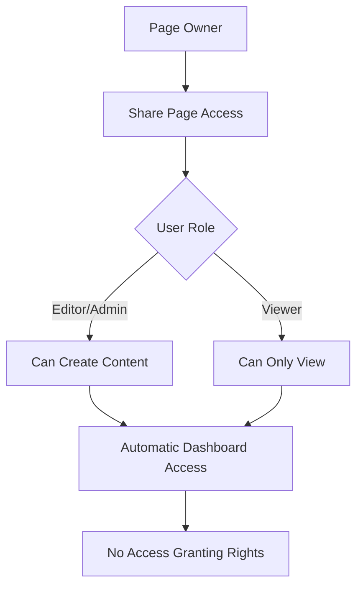
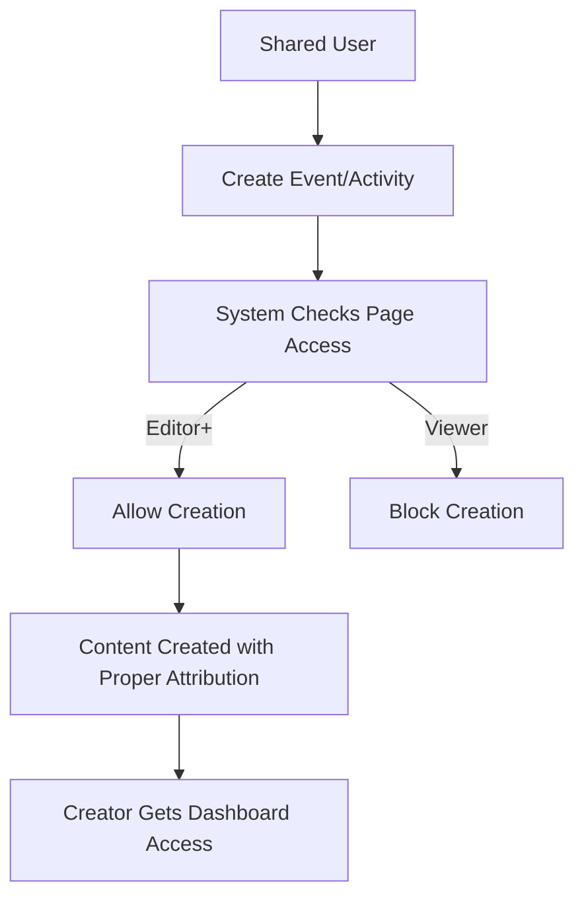
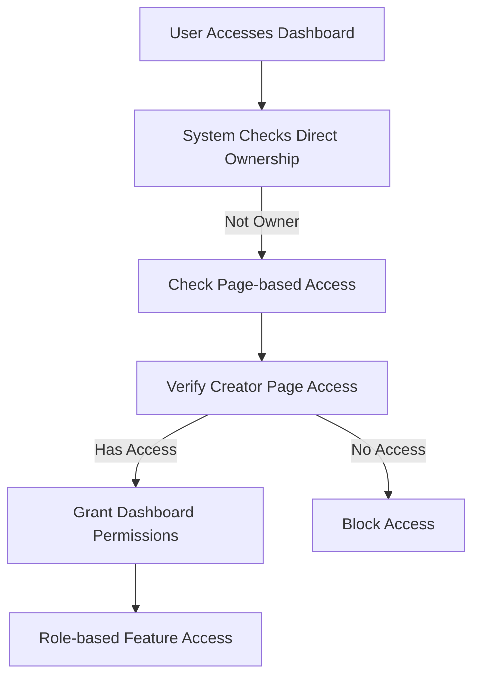

# 🎯 Page-Based Access Inheritance System

## 🚀 **COMPLETE IMPLEMENTATION**

The system now provides **comprehensive page-based access inheritance** where users with access to a page (Artist, Organization, or Venue) automatically inherit permissions for all content created by that page.

---

## 🔧 **SYSTEM OVERVIEW**

### **Core Principle:**
> **"If you have access to a page, you have access to everything that page creates"**

### **Exception:**
> **"Only page owners can grant access to others"**

---

## 📊 **ACCESS INHERITANCE MATRIX**

| Page Access Level | Can View Content | Can Edit Content | Can Create Content | Can Grant Access | Can Delete Content |
|-------------------|------------------|------------------|-------------------|------------------|-------------------|
| **Owner** 👑 | ✅ | ✅ | ✅ | ✅ | ✅ |
| **Admin** 👨‍💼 | ✅ | ✅ | ✅ | ❌ | ✅ |
| **Editor** ✏️ | ✅ | ✅ | ✅ | ❌ | ❌ |
| **Viewer** 👁️ | ✅ | ❌ | ❌ | ❌ | ❌ |

---

## 🎭 **WHAT'S INHERITED**

### **1. Event Access**
- **Dashboard Access** - View/edit event dashboards
- **Attendee Management** - Check-in, manage attendees
- **Financial Access** - View revenue, reports
- **Event Editing** - Modify event details

### **2. Activity Access**
- **Dashboard Access** - View/edit activity dashboards
- **Participant Management** - Manage bookings
- **Activity Editing** - Modify activity details

### **3. Content Creation**
- **Create Events** - Under shared pages
- **Create Activities** - Under shared pages
- **Manage Content** - Edit existing content

### **4. Restricted Actions (Owner-Only)**
- **Grant Access** - Only page owners can share access
- **Remove Access** - Only page owners can revoke access
- **Delete Pages** - Only page owners can delete

---

## 🔒 **SECURITY IMPLEMENTATION**

### **Enhanced Access Control**

#### **1. ContentSharingSecurity**
```typescript
// ✅ BEFORE: Any manager could share
if (!sharerPermissions.canManage && sharerPermissions.role !== 'owner')

// 🚨 ENHANCED: Only owners can share
if (sharerPermissions.role !== 'owner')
```

#### **2. EventCollaborationSecurity**
```typescript
// ✅ BEFORE: Any manager could grant check-in access  
const hasAccess = await this.verifyEventManagementAccess(eventId, inviterId);

// 🚨 ENHANCED: Only owners can grant check-in access
const hasAccess = await this.verifyEventOwnershipAccess(eventId, inviterId);
```

#### **3. Create Page Access**
```typescript
// ✅ BEFORE: Only owned pages
hasSpecificPageAccess = ownedPages.organizations.some(org => org.uid === creatorPageId);

// 🚨 ENHANCED: Owned + shared pages
if (!hasSpecificPageAccess) {
  const permissions = await ContentSharingSecurity.verifyContentAccess(contentType, creatorPageId, user.uid);
  if (permissions.canEdit && (permissions.role === 'editor' || permissions.role === 'admin')) {
    hasSpecificPageAccess = true;
  }
}
```

---

## 🏗️ **IMPLEMENTATION DETAILS**

### **Files Modified:**

#### **1. Create Pages Enhanced**
- `src/app/create/event/page.tsx` - Shared user access
- `src/app/create/activity/page.tsx` - Shared user access

#### **2. Security Systems Enhanced**
- `src/utils/contentSharingSecurity.ts` - Owner-only sharing
- `src/utils/eventCollaborationSecurity.ts` - Owner-only check-in granting

#### **3. Dashboard Access (Already Working)**
- `src/utils/dashboardSecurity.ts` - Event dashboard inheritance
- `src/app/activity-dashboard/[id]/page.tsx` - Activity dashboard inheritance

#### **4. Permission Systems (Already Working)**
- `src/components/RoleGuard/RoleGuard.tsx` - Page access verification
- `src/components/PersonLogo/PersonLogo.tsx` - Shared page display

---

## 🧪 **TESTING SCENARIOS**

### **Scenario 1: Page Sharing**
```bash
1. User A owns "Music Festival Organization" page
2. User A shares page with User B as "Editor"
3. ✅ User B can now:
   - View organization dashboard
   - Edit organization details
   - Create events under this organization
   - Access all event dashboards created by this organization
4. ❌ User B cannot:
   - Grant access to other users
   - Delete the organization page
```

### **Scenario 2: Event Creation**
```bash
1. User B (Editor of shared organization) goes to /create/event
2. URL: /create/event?from=organization&pageId=ABC&name=Music%20Festival
3. ✅ System checks:
   - User B doesn't own page ABC
   - User B has Editor access to page ABC
   - Editor can create content
4. ✅ User B can create event successfully
5. ✅ Event created with proper creator information
```

### **Scenario 3: Dashboard Access**
```bash
1. Organization creates Event X
2. User B (Editor) automatically gets access to Event X dashboard
3. ✅ User B can:
   - View attendees
   - Check-in attendees  
   - Edit event details
   - View financial reports
4. ❌ User B cannot:
   - Grant check-in access to others
   - Delete the event
```

### **Scenario 4: Access Granting Restriction**
```bash
1. User B (Editor) tries to share organization access with User C
2. ❌ System blocks with error: "Only page owners can grant access to others. You have editor access."
3. ✅ Only User A (Owner) can grant access to others
```

---

## 🔄 **ACCESS WORKFLOW**

### **1. Initial Page Sharing**


### **2. Content Creation**


### **3. Dashboard Access**


---

## 🚨 **SECURITY FEATURES**

### **1. Role Hierarchy Enforcement**
- Users cannot grant higher permissions than they have
- Owners > Admins > Editors > Viewers

### **2. Audit Logging**
- All access grants logged
- Failed access attempts tracked
- Security events monitored

### **3. Automatic Cleanup**
- Expired permissions automatically removed
- Orphaned access assignments cleaned up

### **4. Real-time Validation**
- Permissions checked on every action
- Session-based access validation
- Cross-reference verification

---

## 💡 **BENEFITS**

### **For Page Owners:**
- ✅ **Simplified Management** - One place to control all access
- ✅ **Granular Control** - Different permission levels
- ✅ **Security** - Only owners can grant access
- ✅ **Audit Trail** - Complete access history

### **For Shared Users:**
- ✅ **Seamless Access** - Automatic inheritance
- ✅ **Full Functionality** - Can work as if they own content
- ✅ **No Confusion** - Clear permission boundaries
- ✅ **Professional Workflow** - Complete dashboard access

### **For System:**
- ✅ **Consistent Security** - Unified access model
- ✅ **Scalable** - Works for any number of users/pages
- ✅ **Maintainable** - Clear permission structure
- ✅ **Performant** - Efficient permission checking

---

## 🎯 **NEXT STEPS**

The system is now **production-ready** with complete page-based access inheritance. 

### **Optional Enhancements:**
1. **Invitation Email System** - Email notifications for access grants
2. **Access Request System** - Users can request access to pages
3. **Bulk Access Management** - Manage multiple users at once
4. **Access Analytics** - Track how shared access is used
5. **Temporary Access** - Time-limited permissions

**✅ The core inheritance system is complete and ready for use!** 🚀 